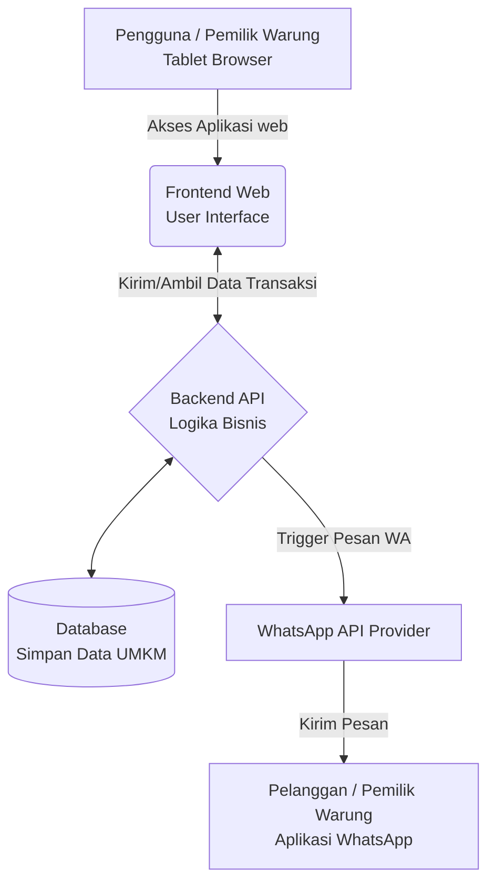
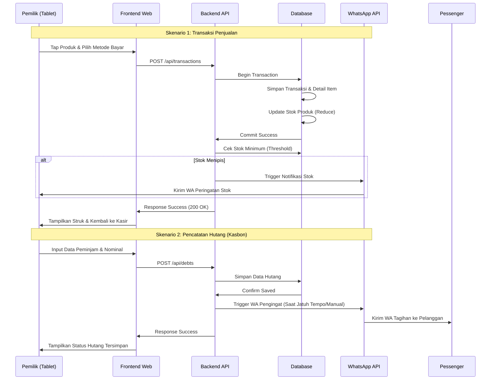
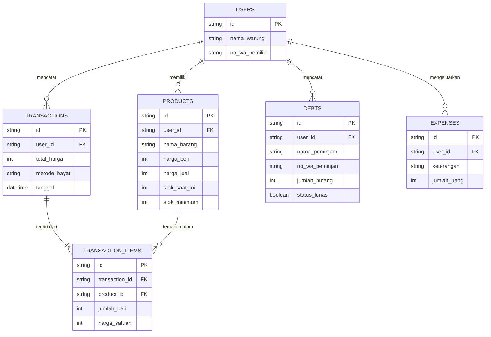

# PRD — Project Requirements Document

## 1. Overview
**Warung OS** adalah aplikasi berbasis web yang dirancang khusus untuk menggantikan buku catatan manual dan kalkulator bagi pemilik UMKM di Indonesia (seperti warung makan, toko kelontong, dan usaha rumahan). 

Banyak UMKM yang saat ini mengalami "kebutaan finansial" (uang pribadi dan usaha tercampur), menebak-nebak jumlah stok barang, dan tidak memiliki catatan keuangan yang rapi untuk mengajukan pinjaman modal (seperti KUR). Warung OS hadir untuk menyelesaikan masalah tersebut dalam satu wadah yang sangat mudah digunakan, mencakup pencatatan penjualan, pembukuan dasar, manajemen stok, hingga pencatatan hutang pelanggan (kasbon).

## 2. Requirements
- **Platform Utama:** Aplikasi Web (Web App), dioptimalkan secara khusus untuk tampilan **Tablet** (kasir warung).
- **Konektivitas:** Berjalan secara *Online* (membutuhkan koneksi internet).
- **Fokus Inventaris:** Hanya melacak barang jadi (*finished goods*), tidak melacak bahan baku.
- **Model Bisnis:** Gratis dasar (*Freemium* / Basic Free) untuk menjaring pengguna baru.
- **Adopsi & Kemudahan:** Transaksi harus bisa diselesaikan di bawah 5 detik murni dengan sentuhan jari (*tap*).
- **Integrasi Eksternal:** Membutuhkan integrasi dengan WhatsApp API untuk mengirim notifikasi stok menipis dan pengingat hutang.

## 3. Core Features
Berikut adalah fitur-fitur MVP (Minimum Viable Product) yang paling penting untuk dibangun pada tahap pertama:

1. **Tap-to-Sell POS (Kasir Cepat)**
   - Layar kasir visual dengan ikon produk. Pengguna hanya perlu *tap* produk untuk memasukkan ke keranjang.
   - Pilihan metode pembayaran yang simpel: Tunai (Cash), QRIS, atau Transfer Bank.
   - Setiap penjualan secara otomatis akan memotong jumlah stok barang dan masuk ke pembukuan.

2. **Buku Hutang (Tracker Kasbon)** 
   - *Fitur andalan untuk menarik pengguna.* Pemilik dapat mencatat pelanggan yang berhutang (kasbon).
   - Menyimpan data: Nama Peminjam, Nomor WhatsApp, dan Jumlah Hutang.
   - Fitur 1-klik untuk mengirim pesan pengingat tagihan yang sopan via WhatsApp secara otomatis.

3. **Pembukuan Otomatis & Laporan PDF**
   - Laporan Laba/Rugi (Income vs Expense) yang sangat sederhana dengan bahasa sehari-hari.
   - Menampilkan metrik keuntungan Harian, Mingguan, dan Bulanan.
   - Punya tombol "Cetak PDF" untuk mengunduh laporan keuangan dasar yang bisa dipakai sebagai syarat pengajuan pinjaman KUR.

4. **Inventaris & Notifikasi Stok Menipis**
   - Menu manajemen produk (Nama barang, Harga beli, Harga jual, Sisa stok).
   - Pengurangan stok otomatis setiap ada transaksi sukses. Input restok/tambah barang dilakukan manual.
   - Peringatan via pesan WhatsApp ke nomor pemilik warung saat stok barang tertentu hampir habis.

## 4. User Flow
Berikut adalah perjalanan sederhana yang akan dialami oleh pengguna:
1. **Daftar & Pengaturan:** Pengguna mendaftar secara gratis, lalu memasukkan daftar barang dagangan beserta harga dan jumlah stok saat ini (via Tablet).
2. **Transaksi Penjualan:** Pelanggan datang membeli barang. Pemilik *tap* ikon barang di aplikasi, memilih metode bayar (misal: QRIS), dan klik "Selesai" (kurang dari 5 detik).
3. **Mencatat Kasbon:** Ada pelanggan langganan ingin berhutang. Pemilik membuka menu "Buku Hutang", memasukkan nama, nomor WA, dan nominal, lalu menyimpannya.
4. **Kirim Pengingat:** Saat jatuh tempo, pemilik membuka "Buku Hutang" dan menekan tombol kirim pesan. Pesan WA otomatis terkirim ke pelanggan bersangkutan.
5. **Cek Keuntungan:** Pemilik membuka "Laporan" untuk melihat untung bersih hari ini dan mengunduh PDF jika besok ingin ke bank mengajukan pinjaman.

## 5. Architecture
Aplikasi ini menggunakan arsitektur monolitik modern yang berjalan di atas Cloud, dengan antarmuka yang membaca data secara langsung dari database dan terhubung ke layanan pihak ketiga (WhatsApp API).

## 6. Sequence Diagram
Bagian ini menjelaskan aliran data teknis secara detail saat terjadi interaksi utama, yaitu Transaksi Penjualan dan Pencatatan Hutang. Diagram ini melibatkan aktor pemilik, frontend, backend, database, dan layanan WhatsApp API.

## 7. Database Schema
Sistem membutuhkan beberapa tabel utama untuk mengatur operasional warung. Berikut adalah skema database secara high-level:

**Tabel Penjelasan:**
- **Users (Pemilik):** `id`, `nama_warung`, `no_wa_pemilik`, `email`
- **Products (Produk):** `id`, `user_id`, `nama_barang`, `harga_beli`, `harga_jual`, `stok_saat_ini`, `stok_minimum`
- **Transactions (Transaksi):** `id`, `user_id`, `total_harga`, `metode_bayar` (Tunai/QRIS), `tanggal`
- **Transaction_Items (Detail Barang):** `id`, `transaction_id`, `product_id`, `jumlah_beli`, `harga_satuan`
- **Debts (Hutang):** `id`, `user_id`, `nama_peminjam`, `no_wa_peminjam`, `jumlah_hutang`, `status_lunas` (Ya/Tidak), `tanggal`
- **Expenses (Pengeluaran):** `id`, `user_id`, `keterangan_pengeluaran`, `jumlah_uang`, `tanggal`

## 8. Tech Stack
Berdasarkan kebutuhan kecepatan pengembangan (MVP), stabilitas, dan performa web app, berikut adalah rekomendasi tumpukan teknologi (Tech Stack) yang akan digunakan:

- **Frontend / Aplikasi UI:** Web framework **Next.js** (berbasis React). Paling optimal untuk web app modern.
- **Styling & Komponen:** **Tailwind CSS** dipadukan dengan **shadcn/ui** untuk membuat tampilan dashboard kasir tablet yang rapi, cepat, dan modern.
- **Backend / API:** Menjadi satu di dalam **Next.js (App Router API)** agar proses *development* lebih cepat tanpa perlu memisahkan server.
- **Database:** **SQLite** — Sangat mumpuni, ringan, dan murah untuk level MVP yang belum membutuhkan database besar/kompleks.
- **ORM (Penghubung Database):** **Drizzle ORM** — Modern, cepat, dan sangat aman digunakan dengan TypeScript.
- **Autentikasi:** **Better Auth** — Layanan autentikasi *open-source* yang aman, mudah, dan gratis untuk login pengguna.
- **Integrasi Ke-3 (WhatsApp):** Menggunakan pihak ketiga seperti **Fonnte**, **Wablas**, atau **Twilio** untuk otomatisasi kirim pesan WA tanpa perlu mengelola server WA sendiri.
- **AI & LLM Integration:** Layanan AI didukung oleh model bahasa besar seperti **OpenAI (GPT-4o-mini)** atau **Google Gemini** via API. Digunakan untuk menjalankan fitur asisten pintar dan analisis data kontekstual.

## 9. Artificial Intelligence Integration
Fitur ini memperkenalkan **WarungOS AI Assistant**, sebuah asisten virtual kontekstual yang dirancang untuk memungkinkan pemilik UMKM mengelola usaha secara intuitif tanpa perlu menelusuri menu atau dashboard secara manual.

### 9.1. Antarmuka & Aksesibilitas (UI/UX)
- **Lokasi UI:** Sidebar kanan yang dapat dibuka/tutup (*collapsible*), selalu menempel di pojok kanan layar aplikasi.
- **Akses Global:** Dapat dipanggil dari halaman mana pun (Kasir, Inventaris, Hutang, Laporan, dll.) tanpa mengganggu alur kerja utama atau menutupi area kerja kasir.
- **Modalitas Interaksi:** Mendukung input teks dan perintah suara (*voice-to-text*). Desain antarmuka menggunakan *bubble chat* sederhana yang responsif terhadap layar tablet ukuran kecil hingga menengah.

### 9.2. Kapabilitas Utama
1. **Tanya Jawab Data Bisnis (RAG - Retrieval Augmented Generation):**
   AI dapat menjawab pertanyaan spesifik berdasarkan data operasional warung yang sebenarnya. Sistem akan mengambil konteks lokal sebelum merespons.
   - *Contoh:* "Berapa sisa stok minyak goreng sekarang?", "Total pemasukan bersih minggu ini berapa?", atau "Siapa daftar pelanggan yang hutangnya belum lunas?"
2. **Saran Optimasi Bisnis & Prediksi:**
   AI menganalisis tren historis dan memberikan rekomendasi proaktif untuk membantu pengambilan keputusan finansial dan inventaris.
   - *Contoh:* "Stok beras cenderung habis dalam 2 hari ke depan, disarankan untuk melakukan restok.", "Penjualan kopi meningkat 25% pada jam 7-9 pagi, pertimbangkan untuk menambahkan varian cup besar.", atau "Pembelian listrik bulan ini naik 15%, apakah ada peralatan baru yang ditambahkan?"
3. **Eksekusi Perintah Cepat (Action & Navigation):**
   AI tidak hanya menjawab, tetapi juga dapat memicu tindakan sederhana di dalam aplikasi melalui perintah teks atau suara.
   - *Contoh:* "Buka halaman Laporan Harian", "Catat pengeluaran beli es balok 50 ribu", atau "Buka form kasbon untuk Pak Budi lalu isi nominal 200 ribu."

### 9.3. Implementasi Teknis & Keamanan
- **Arsitektur RAG:** Data tabel `Transactions`, `Products`, `Debts`, dan `Expenses` akan secara berkala di-*chunk* dan di-*embed* menjadi vector. Vektor ini disimpan di lapisan cache atau vector store ringan. Saat user bertanya, sistem melakukan semantic search untuk mengambil potongan data relevan, lalu menggabungkannya ke dalam prompt sebelum dikirim ke LLM.
- **Penyampaian Prompt & Konteks:** Setiap permintaan AI akan di-*prepend* dengan konteks `user_id`, periode waktu default (hari ini/bulan ini), dan aturan bisnis lokal sebelum masuk ke endpoint LLM.
- **Validasi Aksi:** Untuk perintah eksekusi (seperti mencatat hutang atau membuka halaman), AI hanya akan menghasilkan payload/intent yang diverifikasi oleh frontend/backend. AI tidak memiliki akses tulis langsung (`write-access`) ke database untuk mencegah kesalahan atau perubahan data yang tidak sah.
- **Privasi & Kepatuhan:** Data sensitif di-*anonymize* atau di-*mask* sebelum dikirim ke provider AI eksternal. Sistem hanya mengirim metadata yang diperlukan untuk query. Respons AI dilogging secara lokal untuk audit dan peningkatan prompt (`prompt tuning`) secara berkala.
